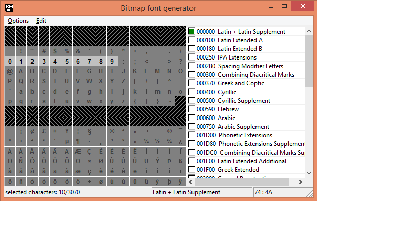

# Fonts

Oxygine supports image-based fonts rendering.
Each font should be generated before running your application by *[BMFont](http://www.angelcode.com/products/bmfont/)* tool.
Generated font consists of pair .png + .fnt file.

BMFont tool is located here:
**3rdPartyTools/BMFont/bmfont.exe**
> for Linux/MacOSX users: BMFont could be launched with Wine

##Exporting fonts
1. Run **bmfont.exe**
2. Select required symbols

3. Select font, size and other settings
4. Export it *(Menu->Options->Save Bitmap Font As)* to folder with your app resources and add it to resources xml file	

	``

> see examples/HelloWorld/data/res.xml

##Advanced usage
Fonts could be automatically generated from BMFont configuration files (.bmfc) by **process_xml2.py** tool.

Add this line to resources xml:

    <bmfc_font file="main.bmfc" chars="eng.txt"/>

> see examples/Demo/data/demo/fonts.xml

Where:

- file="main.bmfc" is your BMFont configuration file
- chars="eng.txt" is text (TF-16 LE encoding) with symbols to export

> read more about process_xml2.py tool
